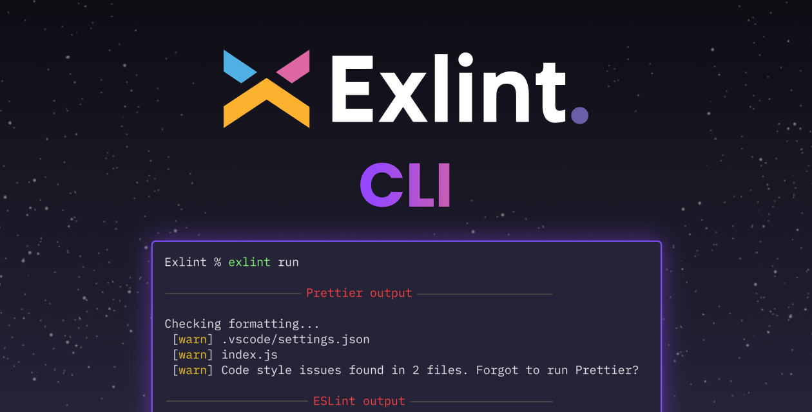

<p align="center">
	<a href="https://github.com/Exlint/cli">
    	
  	</a>
	<a href="https://www.npmjs.com/package/@exlint.io/cli">
    	
  	</a>
	<a href="https://github.com/Exlint/cli">
    	
  	</a>
	<a href="https://github.com/Exlint/cli">
    	
  	</a>
</p>

<p>&nbsp;</p>

<p align="center"></p>

<h2 align="center">Exlint CLI Open Beta</h2>

**👩🏻‍💻 Centralized Code Standards**: Keep your code clean and standardized over multiple repositories.

**📦️ Grouped & Sharable Compliances**: Share and run your coding conventions over any repositories.

**🚀 CI Workflow**: Integrate Exlint into your workflow to continuously prevent coding bad practices.

## Table of Contents

-   [Getting Started](#getting-started)
-   [Running from command line](#running-from-command-line)
-   [CI Workflows](#ci-workflows)
-   [Privacy](#privacy)
-   [Support](#support)
-   [Contributing](#contributing)

    -   [Code of Conduct](#code-of-conduct)

-   [License](#license)

## Getting Started

We recommend installing Exlint CLI globally using [`npm`](https://npmjs.com):

```bash
npm install --global @exlint.io/cli
```

You can also install it locally:

```bash
npm install --save-dev @exlint.io/cli
```

### 🚀 Go Command

```bash
exlint go
```

Get started quickly with Exlint using our `go` command.

Exlint will create a recommended multi-policy compliance based on your project language, and will run the compliance linting result on your terminal.

You can then easily create an account and customize the recommended compliance as you wish (or start from scratch).

## Running from command line


You can run Exlint directly from the CLI (if it's globally available in your `PATH`, e.g. by `npm install --global @exlint.io/cli`) with a variety of useful commands.
If you haven't installed Exlint CLI globally, but locally, you can use it in the CLI by using `npx`.

### Auth Command

```bash
exlint auth
```

Exlint requires you to authenticate. This will allow you to use your configured compliances in the CLI.
First, you should make sure you have created an account and configured your compliance.
When running the command, you will be prompted to your browser to authenticate yourself.
After doing so, you can return back to the CLI and start using Exlint!

### Use Command

```bash
exlint use <compliance_id>
```

When you want to use a compliance you have created in the dashboard, you copy its unique identifier and use it with the `use` command.
Exlint will adjust your IDE (if using VSCode or Webstorm), install required extensions and libraries.
You can easily switch compliances by using the command again!

### Run Command

```bash
exlint run [options]
```

After running the `use` command, you can run your compliance over your code to get CLI results.
Exlint will run your configured libraries against your code and report upon success or failure runs.
If your code fails to match the configured code standards, Exlint will report the issues in the CLI.

#### Options

You can also run the command with `--fix` or `-f` option.
Providinig this option will make Exlint try to automatically fix your code issues.

## CI Workflows

You can run your centralized Exlint compliance also in CI. If you want to integrate an Exlint step in your workflow, you can use the [GitHub Action](https://github.com/Exlint/actions)

## Privacy

Exlint does not and will not, in any way, view / copy / obtain access or intrude user code. Our CLI is 100% open source and will stay this way.
Open source libraries should stay open source, and not used as a means to an end of obscuring privacy.

## Contributing

Development of Exlint CLI happens in the open on GitHub, and we are grateful to the community for contributing bugfixes and improvements.

### Code of Conduct

Exlint has adopted a [Code of Conduct](CODE_OF_CONDUCT.md) that we expect project participants to adhere to.

## License

Exlint is [Apache 2.0 Licensed](./LICENSE).
